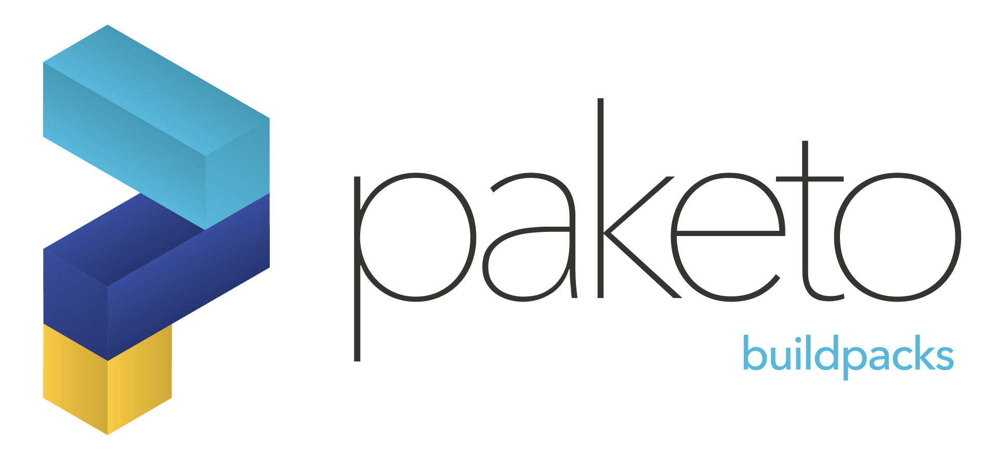

# What are Paketo Buildpacks?

* Buildpacks transform your application source code into container images
* The Paketo open source project provides production-ready buildpacks for the
  most popular languages and frameworks
* Use Paketo Buildpacks to easily build your apps and keep them updated

Learn more about [Paketo](https://paketo.io/) and
[buildpacks](https://buildpacks.io/).

# Join the Paketo open source community!

Here are a few good ways to keep up with developments within the Paketo
Buildpacks community:

## Working Groups

Check out what’s going on in the Paketo Buildpacks community by joining a
[Working Group
meeting](https://github.com/paketo-buildpacks/community#working-group-meetings).
Join discussions about RFCs. See how others are using buildpacks in their
environments. Or, BYOB (bring your own buildpacks!) to share, discuss, and get
feedback from the community.

## Discussions

Do you have ideas for the future of the project? Well, we’d certainly like to
hear them! Check out our [discussions
portal](https://github.com/paketo-buildpacks/feedback/discussions) to weigh in
on ongoing conversations or to start a new one.

## Contributing

If you're interested in contributing, check out our [contribution
guide](https://github.com/paketo-buildpacks/.github/blob/main/CONTRIBUTING.md)
for more details.
